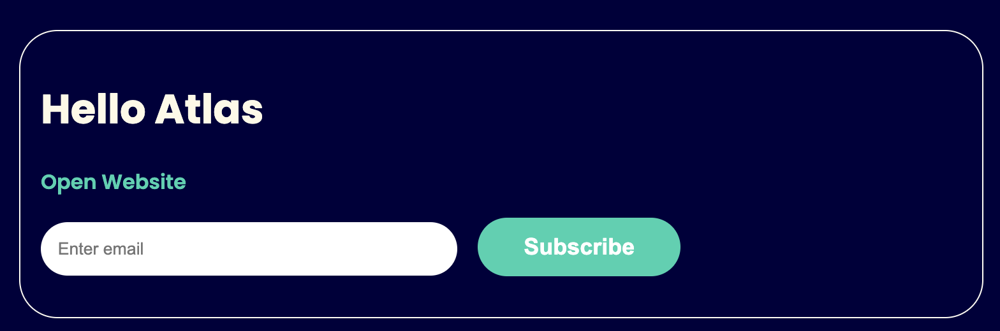
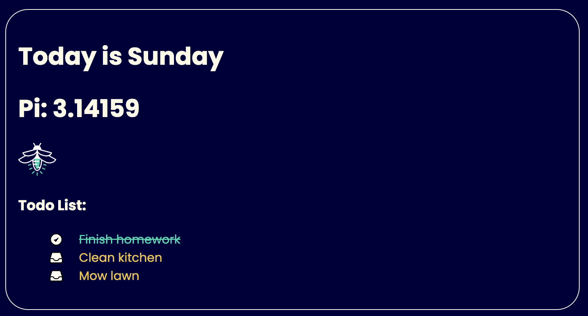
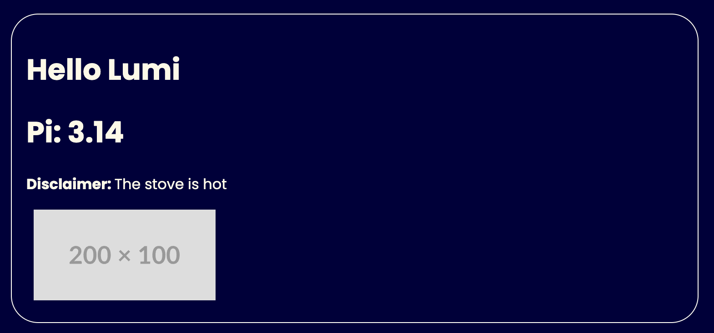
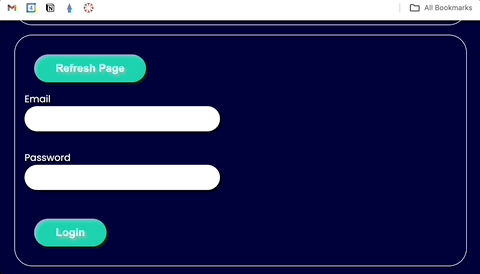

# 0x00 React & JSX

## Getting Started

- Run `npm install` to install dependencies
- Run `npm run dev` to start the dev server
- Open `http://localhost:3000` in a browser

### Dev Container

There is a dev container preconfigured with Node 20 on debian linux. If you would like to use the dev container:

- Install the [Dev Containers Plugin](https://marketplace.visualstudio.com/items?itemName=ms-vscode-remote.remote-containers) for VS Code
- Open the command pallet (Cntrl / Command + Shift + P) in VS Code
- Select "Dev Container: Reopen in Container"

For more information on using dev containers see this [tutorial](https://atlas-jswank.github.io/blog/dev-containers/) or the [official documentation](https://containers.dev/)

### Important Files/Folders

- `src`: All javascript/jsx code goes in this directory
- `src/assets`: Any static assets such as images that are loaded through the javascript files goes here.
- `index.html`: This is the html file that appears when the dev server starts up.

### Important Commands

- `npm run dev`: Starts dev server with Hot Module Reloading on port 3000. Anytime a file changes, the changes will automatocally be reflected in the browser
- `npm run lint`: Run the lint checker with eslint to check for known linting issues
- `npm run format`: Run prettier to automatically reformat files

## Project:

### Resources:

### Learning Objectives:

- Understand how to write react in plain javascript
- Understand how to create react components with jsx
- Understand how react props work
- Understand how event handling works in react

### Tasks

#### 01-plain-react.js

No jsx should be used in this file. Use the `React.createElement` to create all react elements in this file.

- Create a react component called App that will contain all of the components created in this file.
- Add necessary code to render the App component in the div with an ID of "example". (The div is already created in index.html you just need to write the javascript to render the react)
- Create a react element without jsx called `Heading` with a heading tag that says "Hello Atlas"
- Create a react element without jsx call `WebsiteLink` that is a link to the atlas school website. The text of the link should say "Open Website"
- Create a react element without jsx called `GetMoreInformation` that contains:
  - a text input with placeholder text of "Enter email"
  - a button that says "Subscriibe"

This should be the result when complete with this task:

#### 02-jsx.jsx

You should use `jsx` to create all react elements in this file. `React.createElement` should not be used directly in this file.

Rereate the exact same code from `01-plain-react.js` but utilizing jsx. Results should be rendered in the div with an ID of "jsx".

This should be the result when complete with this task:

#### 03-react-components.jsx

- Create a react component called App that will contain all of the components created in this file.
- Add necessary code to render the App component in the div with an ID of "react-components". (The div is already created in index.html you just need to write the javascript to render the react)
- Create a react component called "Today".
  - It should render the text: "Today is [DAY OF THE WEEK]".
  - It should render the correct day of the week.
  - it should use the `moment` libaray to render the day (You will need to install the moment library).
  - Examples:
    - Today is Monday
    - Today is Friday
- Create a react component called "Pi":
  - It should render the value of PI to 5 decimal places.
  - Do not harcode the value of pi. Use the `Math.PI`.
- Create a react component called "Lumi":
  - It should render an image tag for the image `src/assets/lumi.png`
  - Do not move or copy the image from the assets foler.
- Create a react component called "TodoList":
  - It should read the data from `src/assets/data.json` to populate the list
  - Utilize an `ul` and `li` for each todo item.
  - Whenever a todo is done add the class "done" to the `li`.

#### 04-react-props.jsx

- Create a react component called App that will contain all of the components created in this file.
- Add necessary code to render the App component in the div with an ID of "react-props". (The div is already created in index.html you just need to write the javascript to render the react)
- Create a react component called "Greeting"
  - The component has a prop called name.
  - Add the Greeting component to the App component with the name prop set to "Lumi".
  - The component would render "Hello Lumi".
- Create a react component called "Pi"
  - The component takes a prop called "n".
  - The component should render the number PI rounded the "n" digits.
  - Add the Pi component to the App component with "n" set to 2
- Create a react component called "Disclaimer"
  - The component should render a paragraph that prefixes "Disclaimer: " onto the front of the text.
  - Add a Disclaimer tag to the app component that looks like this: `<Disclaimer>The stove is hot</Disclaimer>`
  - The component should render: "Disclaimer: The stove is hot"
- Create a react component call "Placeholder"
  - The component has two props: witdh and height.
  - The component should render an image tag with a place holder image.
  - Use https://placehold.co.
  - The image should have the exact height and width specified in the props.
  - Add a Placeholder component to the App component with a width of 200 and a height of 300.

#### 05-event-handling.jsx

- Create a react component called App that will contain all of the components created in this file.
- Add necessary code to render the App component in the div with an ID of "events". (The div is already created in index.html you just need to write the javascript to render the react)
- Create a component called Refresh
  - The component should render a button with the text "Refresh Page"
  - When the button is clicked, first [confirm](https://developer.mozilla.org/en-US/docs/Web/API/Window/confirm) if the user wants the page to be refreshed
  - If the user clicks ok, refresh the page
  - If the user clicks cancel, do nothing
- Create a component called LoginForm
  - Create a login form.
  - Add a text input and label for an email address.
  - Add a password input and label for the password.
  - Add a submit button.
  - when the user clicks the submit button, show an alert with the email and password entered into the form.

